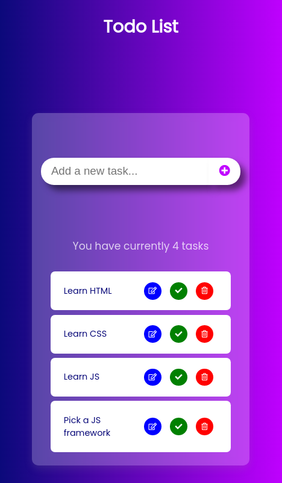
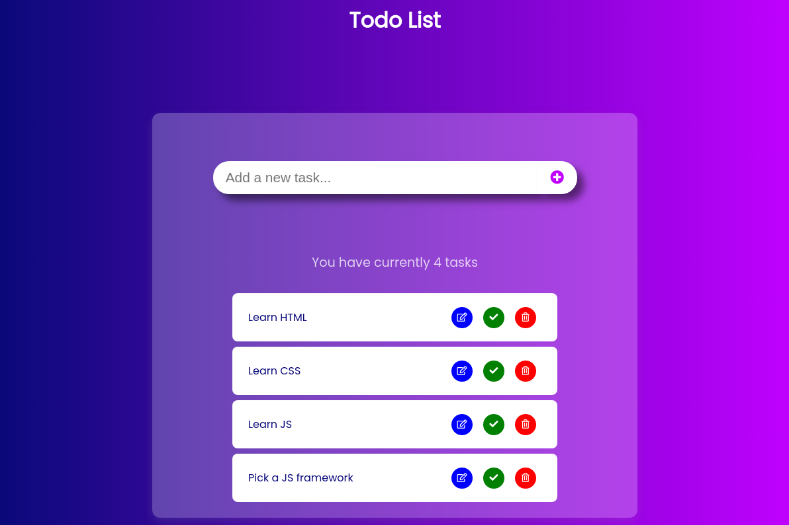

# Todo List

The main purpose was to put into pratice the knowledge gained during the learning of Javascript.

## How to use it ?

To use the app, the user have to input a task to do and submit the form.
If an empty form is submitted, a warning is throwed
Then a list of the submitted tasks is displayed.
The user can edit, mark complete or delete a task.
A counter of the tasks to be done is also displayed and dynamically updated according to the additions and deletions.

## Stack

- HTML
- CSS
- Javascript

## Screenshots

Mobile :

 

Desktop :
 

